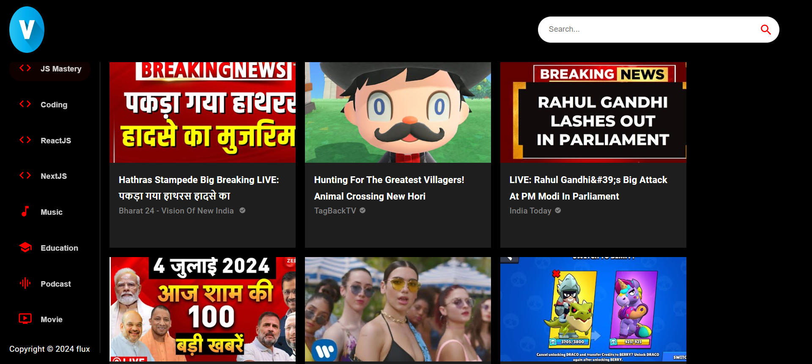

# Modern YouTube Clone Application in React JS with Material UI 
This project is a modern YouTube clone application built using React JS and Material UI. The application aims to mimic the core functionalities of YouTube, including video browsing, searching, and viewing, all within a sleek and responsive user interface.
## Features

- **Home Page**: Displays a list of trending videos.
- **Search Functionality**: Allows users to search for videos by keywords.
- **Video Playback**: Plays videos with controls for play, pause, volume, and fullscreen.
- **Responsive Design**: Optimized for both desktop and mobile views.
- **Material UI**: Utilizes Material UI components for a modern and consistent user experience.

## Technologies Used

- **React JS**: A JavaScript library for building user interfaces.
- **Material UI**: A popular React UI framework that implements Google's Material Design.
- **Axios**: For making API requests.
- **React Router**: For navigation and routing within the application.
- **YouTube API**: For fetching video data and search results.
